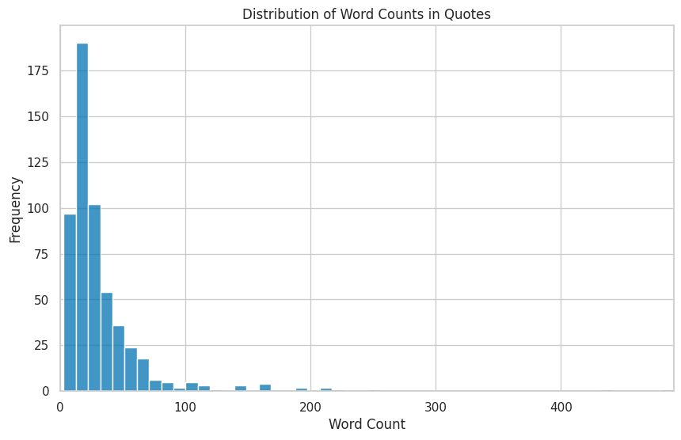
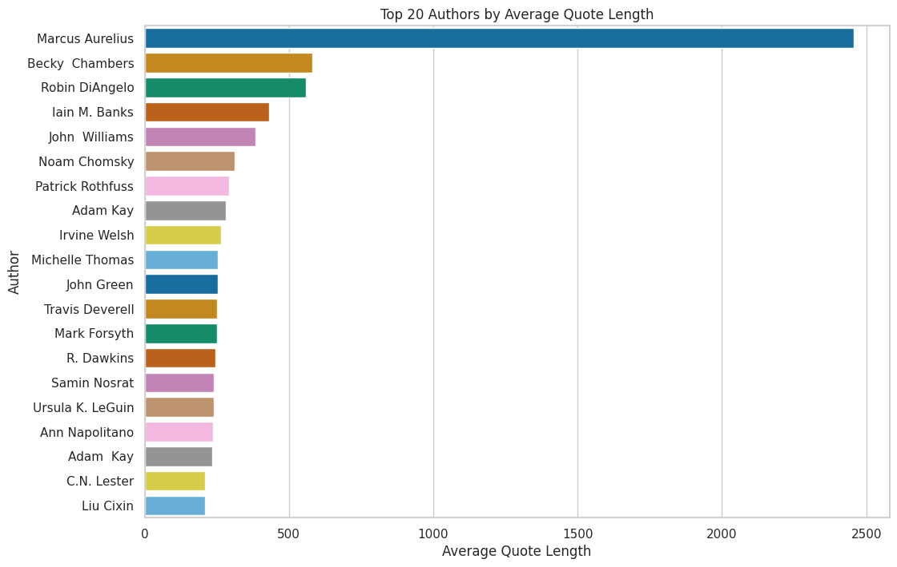
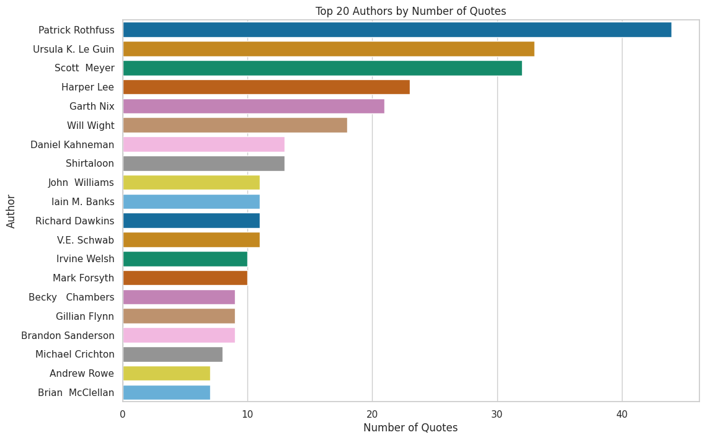
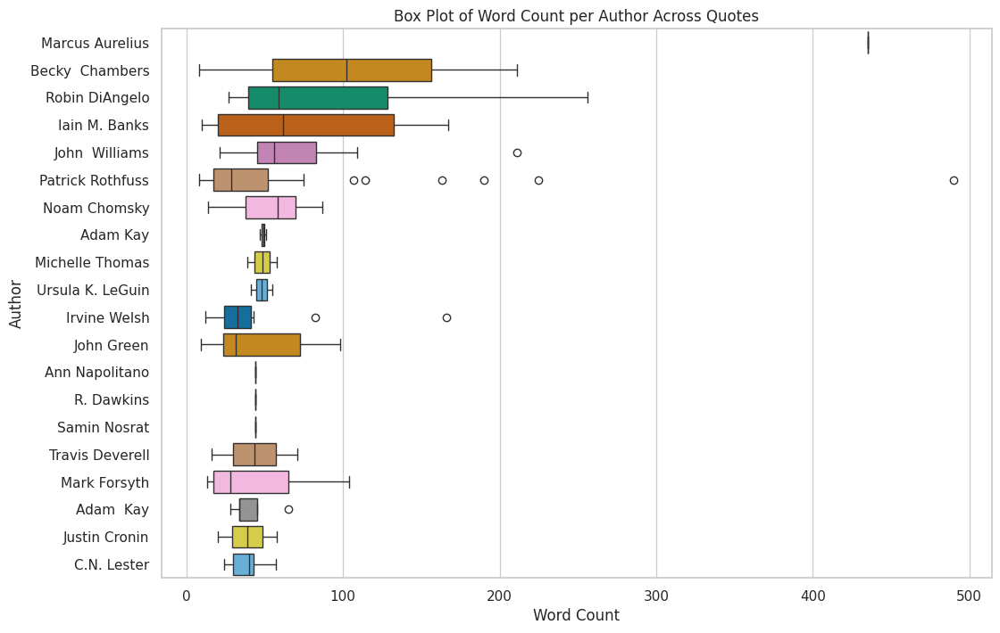

# GoodReads Quotes PDF Generator

A tool for exporting and visualising your highlighted quotes from [GoodReads](https://www.goodreads.com/). Cleans, sorts, and formats quotes into a printable PDF, with exploratory analysis of quoting habits by author, book, and word count.

## Techniques Demonstrated

| Category | Details |
|---|---|
| **Data Wrangling** | CSV ingestion, Unicode normalisation, HTML tag removal |
| **Text Processing** | Quote cleaning, configurable sorting (random, author, title, length) |
| **PDF Generation** | Custom `FPDF` subclass with alternating alignment, auto-pagination |
| **Visualisation** | Seaborn histograms, horizontal bar charts, box plots |
| **Best Practices** | Logging, JSON-based user options, docstrings throughout |

## Quick Start

The notebook includes **sample data (571 quotes)** and runs out of the box — just click "Open in Colab" and run all cells.

## Using Your Own Data

1. Go to your GoodReads profile and export your quotes via **My Quotes → Export**.
2. Open the notebook in Colab — when prompted, upload your `goodreads_quotes_export.csv` (or press Ctrl+C to skip and use the sample data).
3. Adjust the `sort_option` and `max_quote_length` parameters in the first cell to taste.
4. Run all cells — a `quotes.pdf` file will be generated automatically.

## Example Outputs

| | |
|---|---|
|  |  |
|  |  |

## A Note on Quote Analysis

The visualisations reveal interesting patterns in reading and highlighting habits. Authors with longer average quotes tend to be those whose prose style invites extended highlighting, while the word count distribution shows that most readers gravitate toward concise, pithy passages. The box plots expose the variance within prolific authors — some are consistently quoted at length, while others produce a mix of short and long highlights.

## Related

- [GoodReads-Analysis](https://github.com/DrKenReid/GoodReads-Analysis) — comprehensive analysis of reading habits (visualisation, NLP, ML)
- [Enhance-GoodReads-Export](https://github.com/DrKenReid/Enhance-GoodReads-Export) — enrich your GoodReads CSV with genres and reading dates
- [kenreid.co.uk/literature](https://www.kenreid.co.uk/literature.html) — reading stats, reviews, and quotes on my website

## License

This project is licensed under [CC BY 4.0](LICENSE).

## Author

**Ken Reid** — Data Scientist, photographer, and avid reader.

- [kenreid.co.uk](https://www.kenreid.co.uk) — Portfolio & blog
- [@kenreid.co.uk](https://bsky.app/profile/kenreid.co.uk) — Bluesky
- [@DrKenReid](https://github.com/DrKenReid) — GitHub
